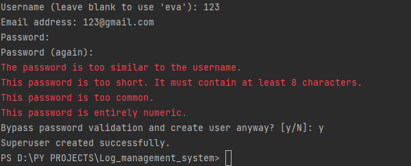
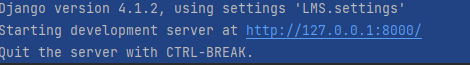
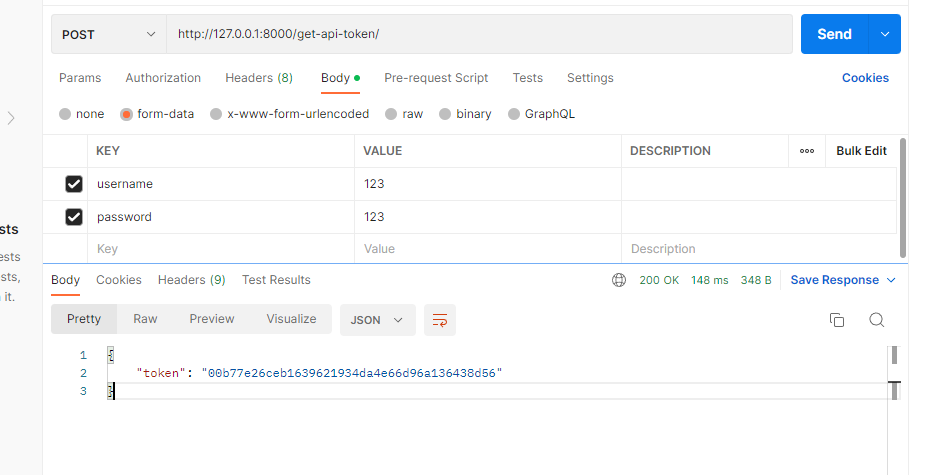
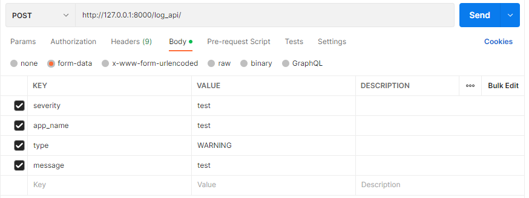
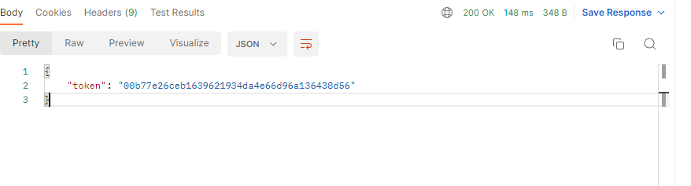
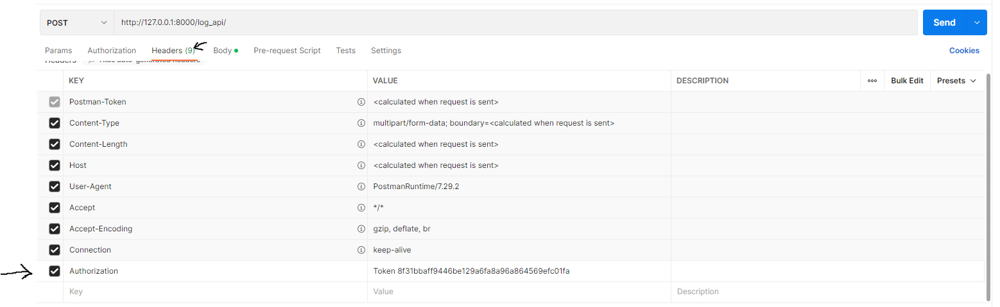
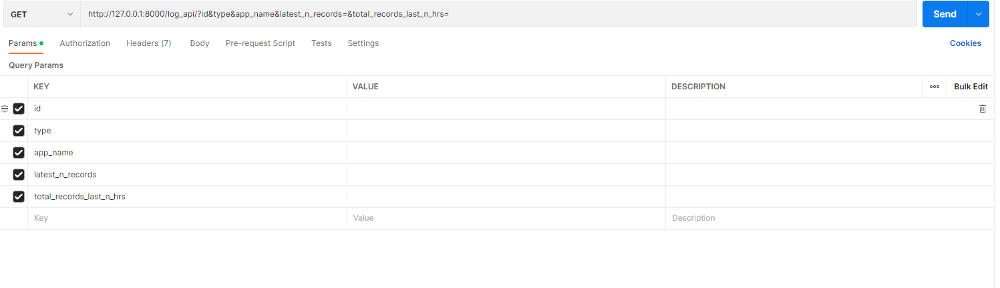

1. Provide the MYSQL db connection details:

    `DATABASES = {
        'default': {
            'ENGINE': 'django.db.backends.mysql', ## Backend for MYSQL
    
            'NAME': 'lms_db', ## Name of the DataBase where app will store the data
    
    
            'USER': 'root', ## Username to access the MYSQL DB. Default is 'root'
    
    
            'PASSWORD': '1234',## Password for the above user profile
    
    
            'HOST': '127.0.0.1', ## Host or IP to connect to MYSQL
    
    
            'PORT': '3306', ## Port at which MYSQL is operating
    
    
            'OPTIONS': {
                'init_command': "SET sql_mode='STRICT_TRANS_TABLES'"
            }
        }
    }`

Note: You can create Database from MYSQL workbench using "CREATE DATABASE <name of the DataBase>"

2. Make Migrations for the Application:

    Use the below Code:  

    `python manage.py makemigrations api`

3. Apply the Migrations using migrate:

    Use the below Code:  

    `python manage.py migrate`

4. Create a Super User:
    
    Use the below Code:  
    
    `python manage.py createsuperuser`
    
    
    
    Press y to skip Password Validation  
    
5. Run the Application: 
    Use the below Code:
    
    `python manage.py runserver`
      
    5.1. Click on the address provided in the terminal:
        
        

6. Obtain the Auth Token for the Authentication of any request:  
    6.1. Open the url 'http://127.0.0.1:8000/get-api-token/' and provide the Admin Username and Password:  
            
        
    6.2 Once the Post Request is submitted with Username and Password as the content, we will recieve a response contaning the Toekn ID:
              
        
    Note: Save the Auth Token as it will be required for further request and response cycles.  
    
7. Performing CRUD (Update and Delete not tested and may nto work) Operations with 'log_api/' endpoint:
      
    **Post Request/Create**
      
    7.1. Open the url 'http://127.0.0.1:8000/log_api/' and provide the following data and select the Method as POST:
                  
        
    7.2. Also In the Header section add another header 'Authorization' and provide the AUth token in the below format:
              
          
          _Note: there is a space after 'Token'_
          
    7.3. Whenever a log entered into the DataBase using the Post method, the response contains the value entered along with Total count of Warning logs in last 2 Hours'warning_cnt_two_hrs'
    Total count of Error logs in last 2 Hours 'agg_error_cnt_two_hrs'.
           
    **GET/ READ**
      
    7.4. Open the url 'http://127.0.0.1:8000/log_api/' and select the Method as GET:  
    
            
    7.5. You can access some ListViews using the parameters displayed in the above screenshot:
        
        a. **latest_n_records**: get the latest N records 
        b. **total_records_last_n_hrs**: get the total number of records in N hours.
        c. Or you can filter based on individual fields
        
    7.6. If you want to view all the records, don't provide any parameter.
    
    
    
    
    
            
    
    
    
    
    
    
