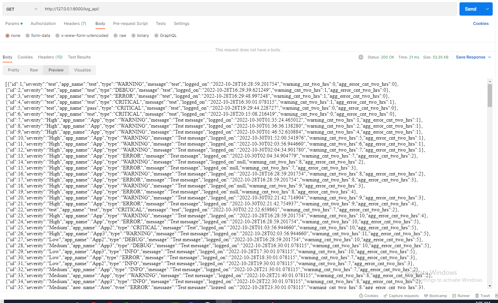

## **LMS(Log Management System)**

**Suggestion**: <br>
- Used POSTMAN in the below Explanation. Please use POSTMAN to send requests and view Responses.
- Use the Log file present in the Sample_log directory to test, OR, create a test case in the same format

**Note**: <br>
This API can be used in Two Ways:

- Directly while logging in the Application, we just need to pass the 'severity', 'app_name', 'type', 'message' values in the Form Data or in a Json format along with the Post Request
- You can Upload already populated Log File. File can be uploaded to the endpoint '/log_api/'.

**WORKFLOW:**

**1.** Provide the MYSQL db connection details:


    ```python
        DATABASES = {
        'default': {
            'ENGINE': 'django.db.backends.mysql', ## Backend for MYSQL
            'NAME': 'lms_db', ## Name of the DataBase where app will store the data
            'USER': 'root', ## Username to access the MYSQL DB. Default is 'root'
            'PASSWORD': '1234',## Password for the above user profile
            'HOST': '127.0.0.1', ## Host or IP to connect to MYSQL
            'PORT': '3306', ## Port at which MYSQL is operating
            'OPTIONS': {
                'init_command': "SET sql_mode='STRICT_TRANS_TABLES'"
            }
        }
    }```

Note: You can create Database from MYSQL workbench using "CREATE DATABASE <'name of the DataBase'>"


**2.** Make Migrations for the Application:<br><br>
        Use the below Code:<br><br>

    `python manage.py makemigrations api`

**3.** Apply the Migrations using migrate:<br><br>
        Use the below Code:<br><br>

    `python manage.py migrate`

**4.** Create a Super User:
        <br><br>Use the below Code:<br><br>
`python manage.py createsuperuser`<br><br>
    <br><br>
    Press y to skip Password Validation<br><br>

**5.** Run the Application:<br><br>
    Use the below Code:<br><br>
    `python manage.py runserver`<br><br>
    5.1. Click on the address provided in the terminal:
      <br><br>
        

**6.** Obtain the Auth Token for the Authentication of any request:<br><br>
    6.1. Open the url 'http://127.0.0.1:8000/get-api-token/' and provide the Admin Username and Password:<br><br>
            
    6.2 Once the Post Request is submitted with Username and Password as the content, we will receive a response containing the Token ID:
            <br><br>
_Note: Save the Auth Token as it will be required for further request and response cycles._<br><br>
    
**7.** Performing CRUD (Update and Delete not tested and may nto work) Operations with 'log_api/' endpoint:
    <br><br>
    **Post Request/Create**
    <br><br>
    7.1. Open the url 'http://127.0.0.1:8000/log_api/' and provide the following data and select the Method as POST:
                <br><br>
    7.2. Also In the Header section add another header 'Authorization' and provide the AUth token in the below format:
            <br><br><br><br>
                _Note: there is a space after 'Token'_<br><br>
    7.3. Whenever a log entered into the DataBase using the Post method, the response contains the value entered along with Total count of Warning logs in last 2 Hours **'warning_cnt_two_hrs'**
    and Total count of Error logs in last 2 Hours **'agg_error_cnt_two_hrs'**.
        <br>
    <br><br>
    **Post Request/Create using File Upload**
    <br><br>
    7.4. Open the url 'http://127.0.0.1:8000/log_api/' and upload the File and select the Method as POST:
        <br><br>
    7.5 Check the Response below for any error in the DateTime field of the Log File.
        <br><br>
    7.6 The Log Entries are now Successfully saved in the DataBase.<br><br>
    **GET/ READ**
    <br><br>
    7.4. Open the url 'http://127.0.0.1:8000/log_api/' and select the Method as GET:<br><br>
    <br><br>
    7.5. You can access some ListViews using the parameters displayed in the above screenshot:<br><br>
        a. **latest_n_records**: get the latest N records <br>
        b. **total_records_last_n_hrs**: get the total number of records in N hours.<br>
        c. Or you can filter based on individual fields<br>
        <br><br>
    7.6. If you want to view all the records, don't provide any parameter.<br><br>
            
<br><br>
    
    
    
    
    
            
    
    
    
    
    
    
